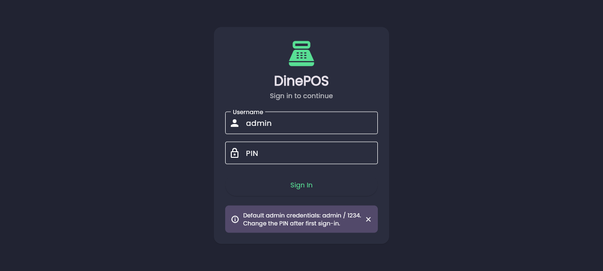
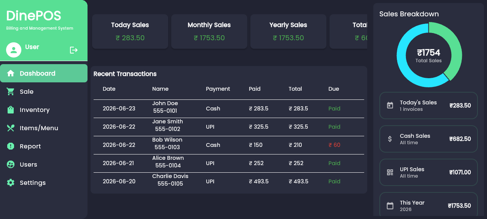
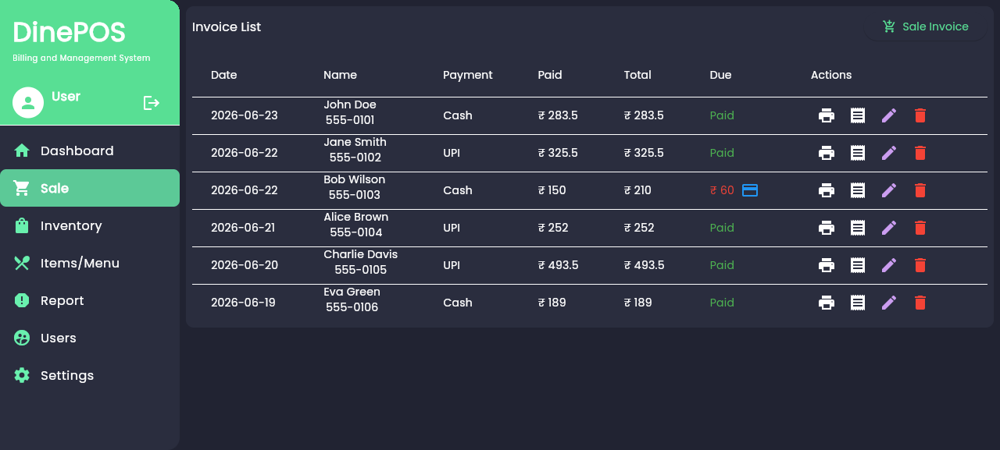
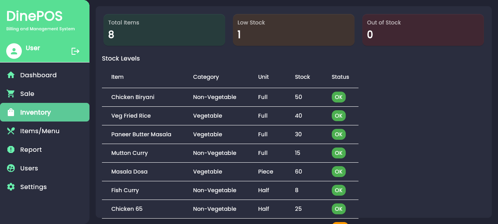
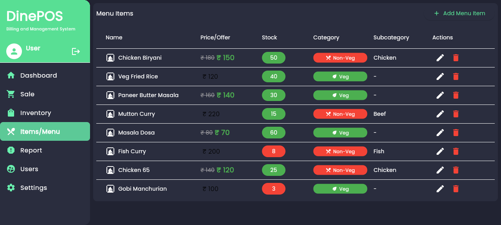
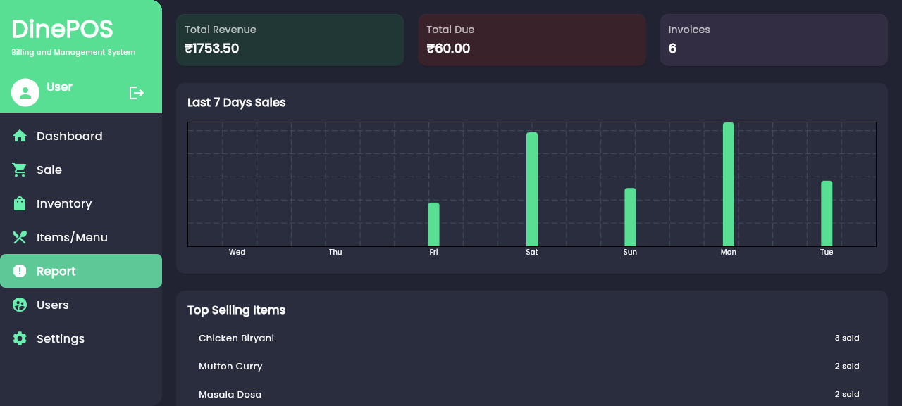
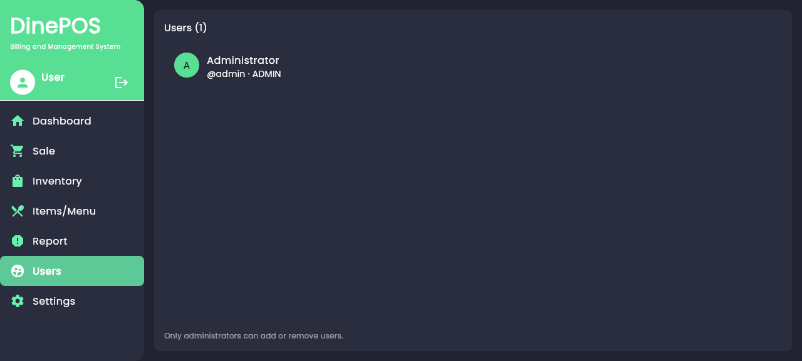
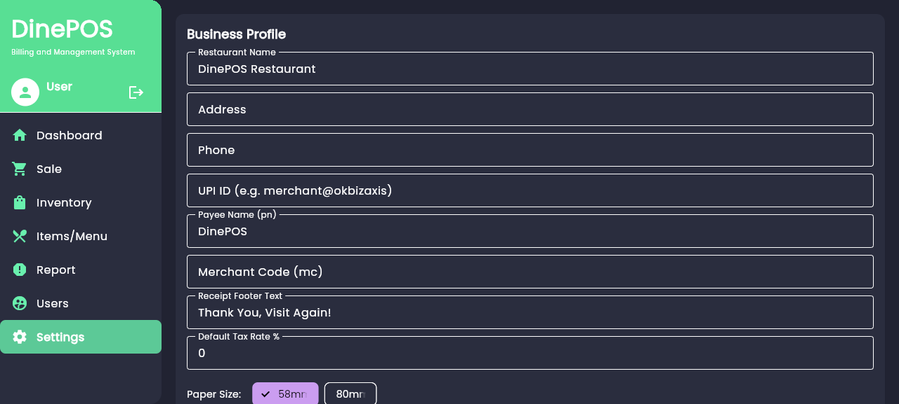

# 🍽️ DinePOS

A versatile and offline-capable restaurant **Point-of-Sale (POS) system** for
managing orders, billing, inventory, users, and reporting. Built with
**Flutter**, using **Hive** for local storage and **Provider** for state
management. Runs on Android, iOS, Windows, macOS, Linux, and Web.

---

## 📸 Screenshots

| Login | Dashboard |
|:---:|:---:|
|  |  |

| Sale / Billing | Inventory |
|:---:|:---:|
|  |  |

| Menu Items | Reports |
|:---:|:---:|
|  |  |

| User Management | Settings |
|:---:|:---:|
|  |  |

---

## ✨ Features

### Core POS
- **Menu Management** — add, edit, delete menu items with images, categories
  (Veg/Non-Veg), sub-categories, unit types, stock and offer pricing.
- **Sale / Billing** — create invoices with discount, tax, payment-type
  selection, and customer details. UPI QR for due payments.
- **Receipt Printing** — USB & BLE thermal printer support (58mm or 80mm
  paper), configurable from the Business Profile.

### Management
- **Dashboard** — today/month/year sales, total due, recent transactions,
  payment-method breakdown pie chart.
- **Inventory** — stock levels with low-stock and out-of-stock alerts.
- **Reports** — 7-day sales bar chart, top-selling items, payment-method
  breakdown.
- **User Management** — role-based users (admin / cashier / staff) with
  PIN login. Admins can add, edit, and remove users.
- **Settings** — editable Business Profile (restaurant name, address, UPI,
  merchant code, footer text, paper size), backup & restore (JSON + ZIP +
  images).

### Security
- 🔐 PIN-based authentication with **SHA-256 hashing** (salted).
- 🔒 Session persistence across app restarts.
- 👥 Role-based access (e.g. only admins manage users).
- 🛡️ **Encrypted Hive boxes** for sensitive data (users, business profile)
  using `HiveAesCipher`.

---

## 🛠️ Tech Stack

| Layer | Technology |
|---|---|
| Framework | Flutter `^3.5.4` |
| Language | Dart |
| State management | Provider (`ChangeNotifier`) |
| Local DB | Hive (with type adapters) |
| Navigation | Flutter `Navigator` |
| Charts | fl_chart |
| Printing | flutter_thermal_printer, esc_pos_utils_plus, pdf, printing |
| QR / UPI | qr_flutter |
| Auth hashing | crypto (SHA-256) |
| Backup | archive (ZIP) |

---

## 🔑 Default Credentials

On first run the app seeds a default admin user:

- **Username:** `admin`
- **PIN:** `1234`

> ⚠️ **Change the PIN immediately** after first sign-in via
> **Users → Edit**.

---

## 🚀 Getting Started

### Prerequisites
- Flutter SDK (`^3.5.4`)
- A physical device or emulator (Android / iOS / Windows / Linux / macOS / Web)

### Setup
```bash
git clone https://github.com/markec12345678/dinepos.git
cd dinepos
flutter pub get
dart run build_runner build --delete-conflicting-outputs   # regenerate Hive adapters
flutter run
```

> The `.g.dart` adapter files are committed, so `build_runner` is only
> required when you change Hive model fields.

### Running on Web
```bash
flutter run -d chrome
```
> On web, thermal printer scanning is disabled (plugin limitation). All other
> features work.

### Release Signing (Android)
Create a `key.properties` file in `android/` with your keystore details:
```properties
storeFile=/path/to/upload.keystore
storePassword=********
keyAlias=upload
keyPassword=********
```
The Gradle config reads this file and signs release builds automatically. If
the file is absent, debug signing is used (local dev only).

---

## 📁 Folder Structure

```
lib/
├── main.dart                      # Entry point, provider setup, auth gate
├── model/                         # Hive-persisted data models
│   ├── business_profile.dart      # Editable restaurant identity (+UPI)
│   ├── invoice_model.dart         # Invoice (with computed getters)
│   ├── invoice_items_model.dart   # Line items
│   ├── menuItem.dart              # Menu item
│   ├── user.dart                  # User (auth)
│   └── *.g.dart                   # Hive type adapters (generated)
├── provider/                      # ChangeNotifier state providers
│   ├── auth_provider.dart         # Login/session/user CRUD
│   ├── InvoiceProvider.dart       # Invoices + cascading delete
│   ├── MenuProvider.dart          # Menu items CRUD + auto-increment IDs
│   └── settings_provider.dart     # Backup / restore
├── pages/                         # Full screens
│   ├── dashboard.dart
│   ├── sale_billing.dart
│   ├── create_invoice.dart
│   ├── inventory.dart
│   ├── menu_items.dart
│   ├── reports.dart
│   ├── user_management.dart
│   └── settings.dart
├── services/                      # Platform-abstraction layer
│   ├── printer_service_interface.dart
│   ├── printer_service_io.dart     # Real thermal printer (Android/iOS/desktop)
│   ├── printer_service_stub.dart   # No-op stub (Web/Linux)
│   └── thermal_printer_service.dart
├── widget/                        # Reusable widgets & dialogs
│   ├── login_screen.dart
│   ├── side_menu.dart             # App shell (responsive drawer)
│   ├── add_items.dart             # Add menu item dialog
│   ├── edit_menu_dialog.dart
│   ├── add_customer_dialog.dart
│   ├── menu_gridview.dart
│   ├── papercut_design.dart
│   ├── printer_settings-dialog.dart
│   ├── unit_icons.dart
│   └── dashboard/
│       ├── chart.dart             # Payment-method pie chart
│       ├── recent_transactions.dart
│       └── storage_details.dart   # Sales breakdown panel
└── utils/
    ├── const.dart                 # Colors, padding, currency symbol
    ├── responsive.dart            # Shared Responsive breakpoints
    ├── image_storage.dart         # Image pick/copy/path helpers
    └── security.dart              # Hive encryption key
```

---

## 📊 Data Model

| Model | typeId | Key fields |
|---|---|---|
| `InvoiceItem` | 0 | id, invoiceId (String), itemName, quantity, price, total |
| `Invoice` | 1 | id, userId, name, phone, address, status, subtotal, discount, taxRate (amount), amountPaid, paymentType, createdAt |
| `MenuItem` | 2 | id, itemName, price, offerPrice, stock, category, subCategory, unitType, description, imageUrl, quantity |
| `BusinessProfile` | 3 | restaurantName, address, phone, upiId, payeeName, merchantCode, footerText, paperSizeMm, currencySymbol, defaultTaxRatePercent |
| `User` | 4 | id, username, pinHash, displayName, role, createdAt |

> **Note:** `Invoice.taxRate` historically stores the tax **amount** (not a
> percentage). The model exposes `taxAmount`, `taxRatePercent`, `grandTotal`,
> `dueAmount`, and `isPaid` computed getters for clarity.

### ID Generation
Invoice IDs and menu item IDs are **monotonically auto-incremented** by their
providers (replacing the previous `Random().nextInt(...)` which risked
collisions).

### Cascading Deletes
Deleting an invoice automatically removes all of its line items (no orphans).

---

## 💾 Backup & Restore

From **Settings → Backup**, the app zips:
- `database_backup.json` — all invoices, invoice items, and menu items
- All images in the `dbImage/` folder

**Restore** picks a `.zip`, extracts it, and reloads the data into Hive.

The `dinepos_db2/` directory and backup files are git-ignored (they may
contain customer/business data).

---

## 🔒 Security

- **PIN hashing**: SHA-256 with a per-install salt (never stored in plaintext).
- **Encrypted Hive boxes**: `users` and `business_profile` boxes are encrypted
  with `HiveAesCipher` using a derived key.
- **Role-based access**: only `admin` users can add/edit/delete users.
- **Session persistence**: logged-in user id is stored in `SharedPreferences`
  so the session survives app restarts.
- **No hardcoded secrets**: UPI VPA, merchant codes, and restaurant identity
  are all configurable from the Business Profile (previously hardcoded).

---

## 🖨️ Thermal Printer Support

Supported on **Android, iOS, macOS, and Windows** via `flutter_thermal_printer`.
On **Web and Linux**, a no-op stub is used (the rest of the app still works).

Features:
- USB and BLE printer scanning
- 58mm and 80mm paper size support (configurable in Business Profile)
- Restaurant identity and footer text from Business Profile
- Last-used printer is remembered (persisted in SharedPreferences)
- ESC/POS receipt generation via `esc_pos_utils_plus`

---

## 🌐 Web Demo Mode

For screenshot capture and testing, append `?demo=1` to the URL to bypass
the login screen:
```
https://your-app-url/flutter?demo=1
```
You can also specify the initial page with `?page=N` (0=Dashboard,
1=Sale, 2=Inventory, 3=Menu, 4=Reports, 5=Users, 6=Settings):
```
https://your-app-url/flutter?demo=1&page=4
```
> This is a development convenience only and does not affect production builds.

---

## 🤝 Contributing

1. Fork the repository.
2. Create a feature branch: `git checkout -b feature-name`.
3. Commit your changes: `git commit -m "Add feature"`.
4. Push and open a pull request.

Please run `flutter analyze` before submitting.

---

## 📝 License

MIT — see [LICENSE](LICENSE).

---

## 🙏 Acknowledgements

- [Flutter](https://flutter.dev) — UI toolkit
- [Hive](https://github.com/hivedb/hive) — Lightweight key-value database
- [Provider](https://github.com/rrousselGit/provider) — State management
- [fl_chart](https://github.com/imaNNeo/fl_chart) — Charts
- [flutter_thermal_printer](https://pub.dev/packages/flutter_thermal_printer) — Thermal printing
- [esc_pos_utils_plus](https://pub.dev/packages/esc_pos_utils_plus) — ESC/POS commands
